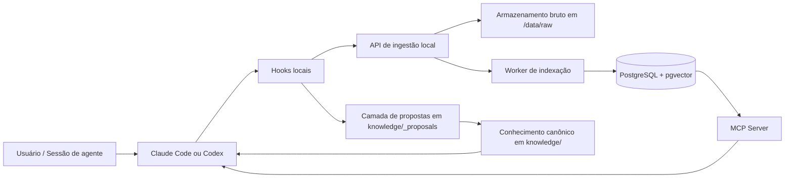
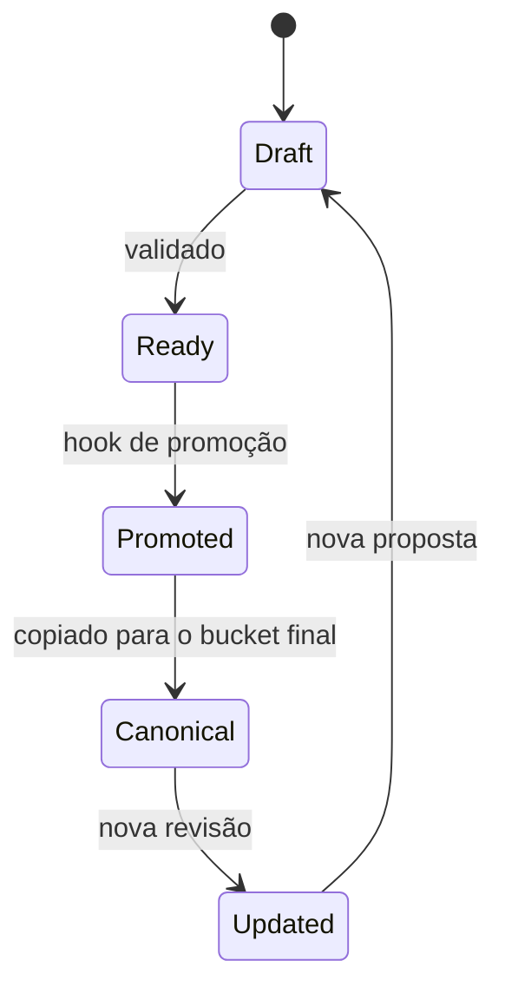
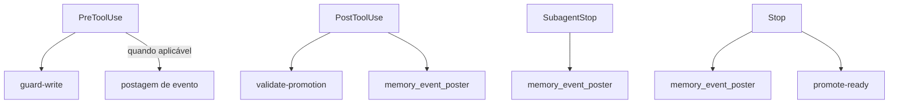
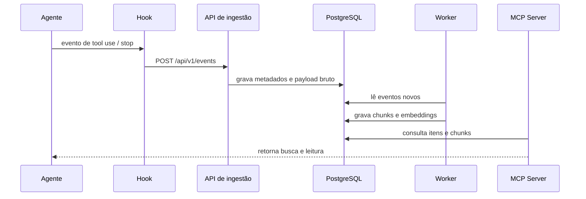
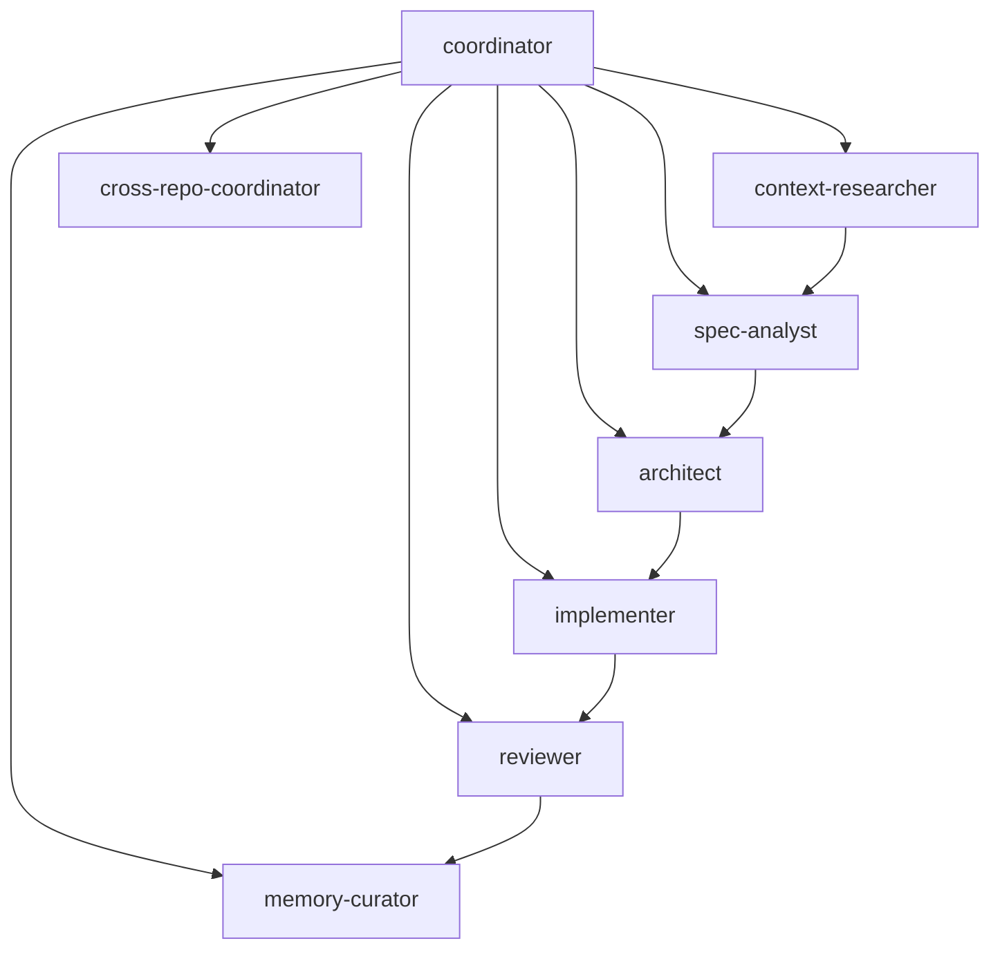
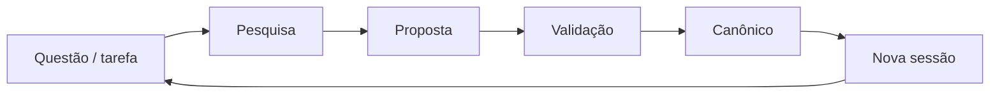
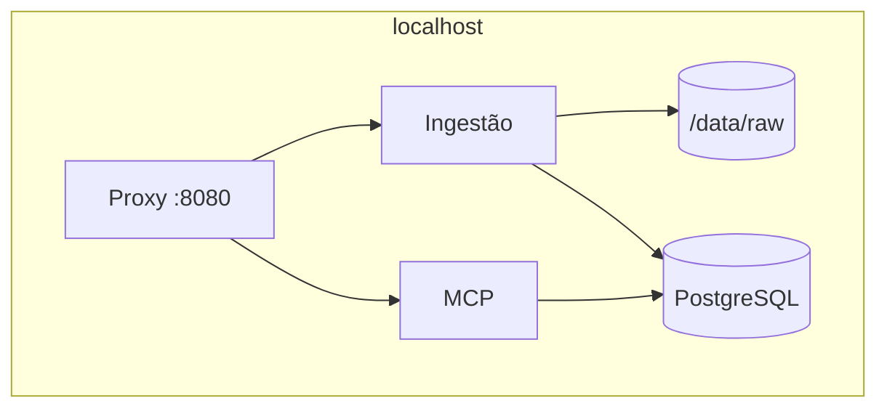

# Documentação do projeto

Este repositório é a referência de arquitetura para memória de agentes de código. A proposta é manter o contexto de trabalho pequeno durante a sessão e mover conhecimento durável para arquivos Markdown com origem rastreável.

O projeto foi desenhado para funcionar com:

- Claude Code
- Codex
- futuros clientes de agentes que consumam a mesma memória

## Visão geral

O objetivo central deste repositório não é guardar tudo no prompt. O objetivo é:

1. Capturar conhecimento de forma enxuta e com fonte.
2. Organizar esse conhecimento em camadas estáveis.
3. Validar mudanças com hooks e regras de escrita.
4. Promover aprendizados repetidos para documentação canônica.
5. Reutilizar a mesma base entre múltiplos agentes e múltiplos repositórios.

Na prática, isso significa que o repositório funciona como um sistema de memória versionada para agentes:

- conversas curtas viram contexto de trabalho
- contexto de trabalho vira proposta
- proposta validada vira conhecimento canônico
- conhecimento canônico alimenta novas sessões

## Estrutura principal

```text
.
├── AGENTS.md
├── CLAUDE.md
├── CODEX.md
├── QUICKSTART.md
├── README.md
├── DOCUMENTACAO.md
├── knowledge/
├── hooks/
├── local_stack/
├── scripts/
├── .claude/
├── .codex/
├── .agents/
└── .github/
```

### Arquivos de entrada

- `README.md`: visão geral em inglês do projeto.
- `QUICKSTART.md`: caminho rápido de leitura e bootstrap.
- `AGENTS.md`: instruções base para agentes e colaboração.
- `CLAUDE.md`: instruções específicas para Claude Code.
- `CODEX.md`: instruções específicas para Codex.

### Diretórios centrais

- `knowledge/`: camada durável de conhecimento.
- `hooks/`: enforcement, validação e promoção.
- `local_stack/`: stack local mínima com API, worker e MCP server.
- `scripts/`: instalação, empacotamento e smoke tests.
- `.claude/`: configuração e ativos do Claude Code.
- `.codex/`: configuração, hooks, agentes e integração do Codex.
- `.agents/skills/`: skills reutilizáveis para Codex.
- `.github/`: automações e template de pull request.

## Arquitetura geral



### Leitura do diagrama

- O agente gera ou consome contexto.
- Os hooks aplicam política antes e depois de certas ações.
- O stack local recebe eventos e indexa conteúdo.
- O conhecimento validado vai para `knowledge/`.
- O MCP server expõe leitura e busca para os agentes.

## Camada de conhecimento

O diretório `knowledge/` é o núcleo de memória durável do projeto. É aqui que ficam os fatos reutilizáveis que devem sobreviver entre sessões e ferramentas.

### Subdiretórios

- `knowledge/org/`: políticas e invariantes da organização.
- `knowledge/products/`: comportamento compartilhado entre repositórios de um produto.
- `knowledge/domains/`: regras de domínio e glossário.
- `knowledge/repos/`: convenções e exceções específicas do repositório.
- `knowledge/specs/`: specs SDD e histórico de specs.
- `knowledge/adr/`: decisões arquiteturais.
- `knowledge/incidents/`: incidentes, postmortems e lições.
- `knowledge/runbooks/`: procedimentos operacionais.
- `knowledge/glossary/`: termos canônicos.
- `knowledge/integrations/`: contratos com sistemas externos.
- `knowledge/_proposals/`: rascunhos antes da promoção.

### Regra de ouro

Se algo ainda está em investigação, vai para `_proposals/`.
Se algo já foi validado e é estável, vai para o bucket canônico correspondente.

### Fluxo de promoção do conhecimento



## Hooks e enforcement

Os hooks existem para impor contrato e reduzir erro humano. Eles não tomam decisões de negócio, apenas controlam fluxo e integridade.

### Papel dos hooks

- bloquear escrita direta em conhecimento canônico quando a origem não é adequada
- validar propostas antes de promoção
- publicar eventos de sessão e subagente
- promover propostas prontas automaticamente

### Mapa de hooks



### Regras importantes

- hooks devem falhar de forma segura quando faltar metadado essencial
- hooks não devem inventar conhecimento
- hooks não devem sobrescrever notas canônicas com corpo diferente sem regra explícita
- hooks devem preservar proveniência

### Bootstrap de contexto do projeto

No início da sessão, o sistema pode montar um snapshot de entendimento do repositório antes mesmo de existir uma proposal ou uma nota nova em `knowledge/`.

Esse snapshot usa um conjunto fixo de arquivos operacionais do projeto:

- `AGENTS.md`
- `README.md`
- `QUICKSTART.md`
- `CODEX.md`
- `CLAUDE.md`
- `knowledge/README.md`
- `hooks/README.md`
- `local_stack/README.md`
- `.codex/README.md`
- `.claude/CLAUDE.md`

Esses arquivos não são enviados como eventos independentes no bootstrap. Eles são lidos, concatenados e transformados em um único documento sintético de contexto inicial da sessão.

### O que vai para a API de ingestão

Há três categorias principais de envio para a API local:

- `repo_handoff`: snapshot consolidado do entendimento inicial do repositório.
- `canonical_sync`: reenvio persistente dos arquivos canônicos de `knowledge/`.
- `session_stop`, `subagent_stop` e eventos de trabalho: resumo do que aconteceu durante a sessão ou durante execuções de subagentes.

### Diferença entre bootstrap e sync canônico

- O bootstrap serve para dar contexto operacional ao indexador logo no começo da sessão.
- O sync canônico serve para manter a API local alinhada com a fonte oficial de memória em Markdown.
- O resumo de sessão serve para registrar o trabalho realmente executado, inclusive em modo de edição.

## Stack local

O diretório `local_stack/` contém a implementação local mínima da arquitetura.

### Componentes

- `api/`: API de ingestão em Rust.
- `worker/`: indexador assíncrono.
- `mcp-server/`: servidor MCP em Rust.
- PostgreSQL: armazenamento de metadados.
- `pgvector`: armazenamento vetorial para chunks.

### Fluxo técnico



### Endpoints e superfícies

- `POST /api/v1/events`: recebe eventos de hooks.
- `GET /api/healthz`: saúde da API.
- `GET /api/v1/items`: lista itens indexados.
- `GET /api/v1/chunks`: lista chunks indexados.
- `/mcp`: superfície MCP para leitura.

### Contrato de dados

- o conteúdo bruto é preservado em formato Markdown
- a ingestão é append-only
- os metadados vivem no PostgreSQL
- os chunks recebem embeddings vetoriais
- o MCP server lê diretamente do banco

## Configuração do Codex

O diretório `.codex/` torna a memória parte do ambiente padrão do Codex.

### Conteúdo relevante

- `config.toml`: configuração de agentes, hooks e MCP.
- `hooks.json`: mapeamento de lifecycle hooks.
- `agents/*.toml`: agentes especializados.
- integração com `.agents/skills/`.

### Configuração de MCP

O projeto registra dois servidores MCP:

- `localMemory`: memória local do repositório
- `openaiDeveloperDocs`: documentação oficial da OpenAI

O servidor `localMemory` aponta para:

```txt
http://127.0.0.1:8080/mcp
```

Isso permite que o Codex consulte o repositório e a memória local sem depender de contexto manual longo.

## Configuração do Claude Code

O fluxo do Claude Code é semelhante, mas usa os arquivos e regras do ecossistema `.claude/`.

### Componentes relevantes

- `CLAUDE.md`
- `.claude/CLAUDE.md`
- `.claude/rules/`
- `.claude/agents/`
- `.claude/templates/`
- `.claude/skills/`

### Instalação

Os scripts em `scripts/` instalam os ativos locais e globais necessários para que o Claude Code carregue:

- agentes
- skills
- hooks
- registro de MCP do `localMemory`

## Agentes especializados

O projeto separa funções de trabalho em agentes especializados.

### Funções principais

- `coordinator`: mantém a sessão principal pequena.
- `context-researcher`: coleta contexto mínimo com fonte.
- `spec-analyst`: transforma pedido em spec.
- `architect`: avalia impacto estrutural.
- `implementer`: faz a mudança em código ou documentação.
- `reviewer`: valida correção, segurança e deriva.
- `incident-analyst`: transforma incidentes em conhecimento operacional.
- `memory-curator`: promove aprendizado durável.
- `cross-repo-coordinator`: sincroniza regras entre repositórios.

### Diagrama de colaboração



## Skills

As skills do Codex ficam em `.agents/skills/` e encapsulam workflows reutilizáveis.

### Skills presentes

- `context-pack`: compacta fontes em um pacote mínimo de contexto.
- `memory-curation`: promove aprendizado recorrente para conhecimento canônico.
- `cross-repo-synthesis`: compara o mesmo conceito entre repositórios.

Essas skills existem para evitar reexplicar o mesmo fluxo em cada sessão.

## Scripts

O diretório `scripts/` concentra automações de instalação, empacotamento e verificação.

### Principais scripts

- `scripts/install_claude_assets.py`
- `scripts/install_codex_assets.py`
- `scripts/install_public_release.py`
- `scripts/package_release.py`
- `scripts/publish_local_stack_images.py`
- `scripts/smoke_test_local_memory_stack.py`
- `scripts/stack_urls.py`

### Uso típico

- instalação local do Claude Code
- instalação global do Codex
- geração de release
- publicação de imagens
- smoke test do stack local

## Fluxos suportados

### Fluxo de pesquisa

1. Solicitação do usuário.
2. Coleta de contexto fonte-qualificado.
3. Empacotamento em `Context Pack`.
4. Execução da tarefa.
5. Registro do delta de memória.
6. Promoção para documento canônico.

### Fluxo SDD

1. Pedido.
2. Spec.
3. ADR, se necessário.
4. Implementação.
5. Revisão.
6. Promoção da lição aprendida.

### Fluxo de incidente

1. Incidente.
2. Postmortem.
3. Runbook.
4. Lição aprendida.
5. Promoção canônica.

### Fluxo cross-repo

1. Identificar invariantes compartilhados.
2. Definir o local canônico.
3. Escrever a nota compartilhada.
4. Criar os deltas por repositório.
5. Sincronizar os consumidores.

## Instalação e uso local

### Pré-requisitos

- Docker e Docker Compose
- Python 3
- ambiente confiável para Claude Code ou Codex

### Subir o stack local

```bash
docker compose up --build
```

### Rodar o smoke test

```bash
python3 scripts/smoke_test_local_memory_stack.py
```

O smoke test:

- sobe o stack
- publica um evento de hook
- espera indexação
- valida item e chunk com embedding
- derruba o stack ao final, salvo se `--keep-up` for usado

### Instalar ativos do Codex

```bash
python3 scripts/install_codex_assets.py --dry-run --stack-host 127.0.0.1
python3 scripts/install_codex_assets.py --stack-host 127.0.0.1
```

### Instalar ativos do Claude Code

```bash
python3 scripts/install_claude_assets.py --dry-run --stack-host 127.0.0.1
python3 scripts/install_claude_assets.py --stack-host 127.0.0.1
```

## Convenções do repositório

- conhecimento estável deve morar no bucket de maior escopo aplicável
- exceções locais devem apontar para a nota compartilhada
- propostas não viram canônicas sem validação
- proveniência deve permanecer explícita
- notas canônicas devem dizer escopo, origem e dono

## Automação de pull request

O repositório tem automação para abrir PRs de branches `feature/*` quando a configuração de token existe.

### Comportamento

- branch `feature/*` pode disparar abertura automática de PR
- sem `PR_AUTOMATION_TOKEN`, a automação não falha; ela apenas pula a criação

## Diagramas resumidos

### Ciclo completo de conhecimento



### Topologia do stack local



## Como ler este repositório

Se você é novo no projeto, a sequência mais eficiente é:

1. `AGENTS.md`
2. `README.md`
3. `QUICKSTART.md`
4. `knowledge/README.md`
5. `hooks/README.md`
6. `local_stack/README.md`
7. `.codex/README.md`

## Resumo final

Este repositório formaliza um sistema de memória de agentes com:

- conhecimento versionado em Markdown
- camadas claras de escopo
- hooks para enforcement
- stack local para ingestão e leitura
- integração com Claude Code e Codex
- promoção controlada do que é durável

Em outras palavras: o objetivo é transformar sessões curtas em conhecimento reutilizável, sem deixar o contexto crescer sem limite.
