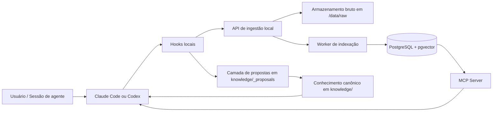
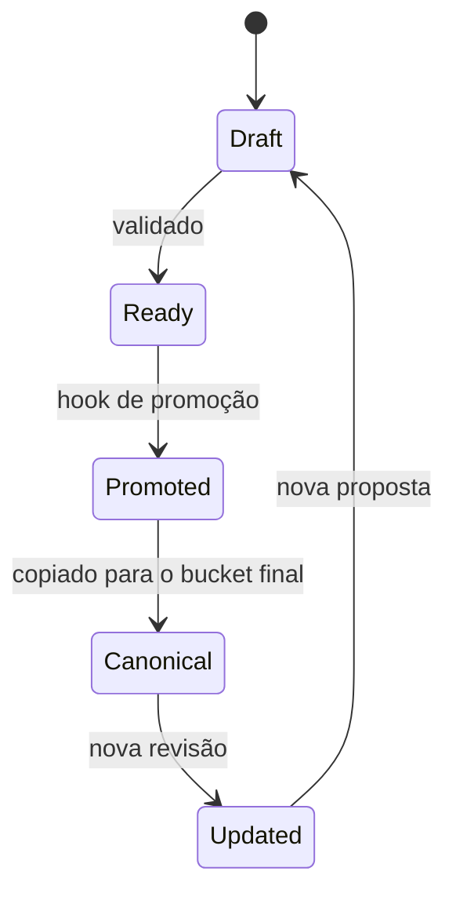
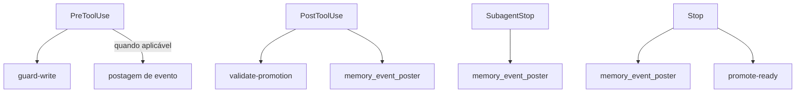
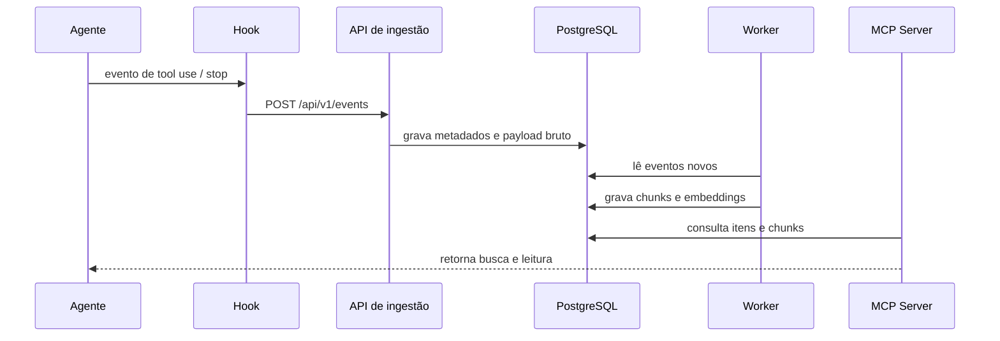
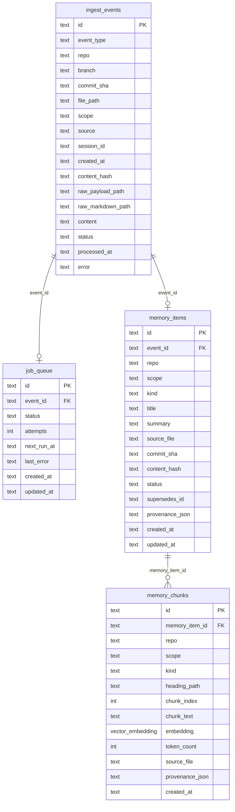
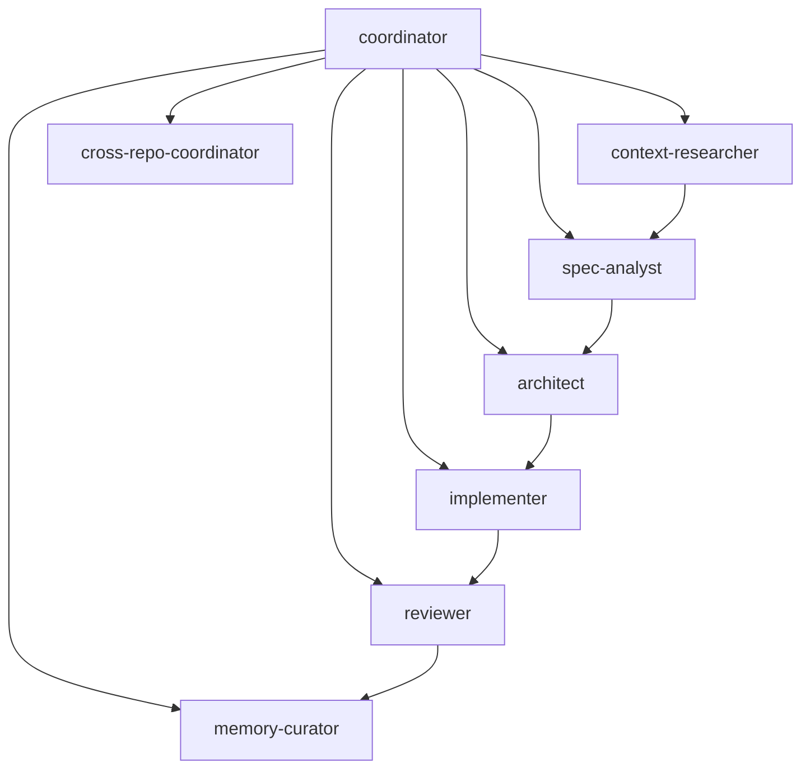
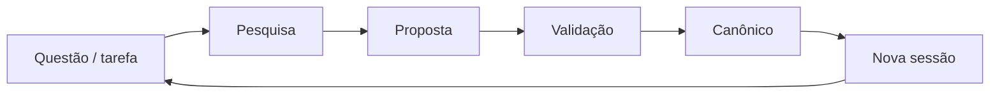
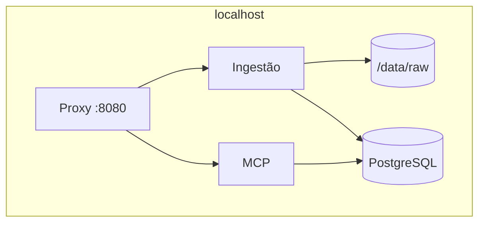

# Documentação do projeto

Este repositório é a referência de arquitetura para memória de agentes de código. A proposta é manter o contexto de trabalho pequeno durante a sessão e mover conhecimento durável para arquivos Markdown com origem rastreável.

O projeto foi desenhado para funcionar com:

- Claude Code
- Codex
- futuros clientes de agentes que consumam a mesma memória

## Visão geral

O objetivo central deste repositório não é guardar tudo no prompt. O objetivo é:

1. Capturar conhecimento de forma enxuta e com fonte.
2. Organizar esse conhecimento em camadas estáveis.
3. Validar mudanças com hooks e regras de escrita.
4. Promover aprendizados repetidos para documentação canônica.
5. Reutilizar a mesma base entre múltiplos agentes e múltiplos repositórios.

Na prática, isso significa que o repositório funciona como um sistema de memória versionada para agentes:

- conversas curtas viram contexto de trabalho
- contexto de trabalho vira proposta
- proposta validada vira conhecimento canônico
- conhecimento canônico alimenta novas sessões

## Estrutura principal

```text
.
├── AGENTS.md
├── CLAUDE.md
├── CODEX.md
├── QUICKSTART.md
├── README.md
├── DOCUMENTACAO.md
├── knowledge/
├── hooks/
├── local_stack/
├── scripts/
├── .claude/
├── .codex/
├── .agents/
└── .github/
```

### Arquivos de entrada

- `README.md`: visão geral em inglês do projeto.
- `QUICKSTART.md`: caminho rápido de leitura e bootstrap.
- `AGENTS.md`: instruções base para agentes e colaboração.
- `CLAUDE.md`: instruções específicas para Claude Code.
- `CODEX.md`: instruções específicas para Codex.

### Diretórios centrais

- `knowledge/`: camada durável de conhecimento.
- `hooks/`: enforcement, validação e promoção.
- `local_stack/`: stack local mínima com API, worker e MCP server.
- `scripts/`: instalação, empacotamento e smoke tests.
- `.claude/`: configuração e ativos do Claude Code.
- `.codex/`: configuração, hooks, agentes e integração do Codex.
- `.agents/skills/`: skills reutilizáveis para Codex.
- `.github/`: automações e template de pull request.

## Arquitetura geral



### Leitura do diagrama

- O agente gera ou consome contexto.
- Os hooks aplicam política antes e depois de certas ações.
- O stack local recebe eventos e indexa conteúdo.
- O conhecimento validado vai para `knowledge/`.
- O MCP server expõe leitura e busca para os agentes.

## Camada de conhecimento

O diretório `knowledge/` é o núcleo de memória durável do projeto. É aqui que ficam os fatos reutilizáveis que devem sobreviver entre sessões e ferramentas.

### Subdiretórios

- `knowledge/org/`: políticas e invariantes da organização.
- `knowledge/products/`: comportamento compartilhado entre repositórios de um produto.
- `knowledge/domains/`: regras de domínio e glossário.
- `knowledge/repos/`: convenções e exceções específicas do repositório.
- `knowledge/specs/`: specs SDD e histórico de specs.
- `knowledge/adr/`: decisões arquiteturais.
- `knowledge/incidents/`: incidentes, postmortems e lições.
- `knowledge/runbooks/`: procedimentos operacionais.
- `knowledge/glossary/`: termos canônicos.
- `knowledge/integrations/`: contratos com sistemas externos.
- `knowledge/_proposals/`: rascunhos antes da promoção.

### Regra de ouro

Se algo ainda está em investigação, vai para `_proposals/`.
Se algo já foi validado e é estável, vai para o bucket canônico correspondente.

### Fluxo de promoção do conhecimento



## Hooks e enforcement

Os hooks existem para impor contrato e reduzir erro humano. Eles não tomam decisões de negócio, apenas controlam fluxo e integridade.

### Papel dos hooks

- bloquear escrita direta em conhecimento canônico quando a origem não é adequada
- validar propostas antes de promoção
- publicar eventos de sessão e subagente
- promover propostas prontas automaticamente

### Mapa de hooks



### Regras importantes

- hooks devem falhar de forma segura quando faltar metadado essencial
- hooks não devem inventar conhecimento
- hooks não devem sobrescrever notas canônicas com corpo diferente sem regra explícita
- hooks devem preservar proveniência

### Bootstrap de contexto do projeto

No início da sessão, o sistema pode montar um snapshot de entendimento do repositório antes mesmo de existir uma proposal ou uma nota nova em `knowledge/`.

Esse snapshot usa um conjunto fixo de arquivos operacionais do projeto:

- `AGENTS.md`
- `README.md`
- `QUICKSTART.md`
- `CODEX.md`
- `CLAUDE.md`
- `knowledge/README.md`
- `hooks/README.md`
- `local_stack/README.md`
- `.codex/README.md`
- `.claude/CLAUDE.md`

Esses arquivos não são enviados como eventos independentes no bootstrap. Eles são lidos, concatenados e transformados em um único documento sintético de contexto inicial da sessão.

### O que vai para a API de ingestão

Há três categorias principais de envio para a API local:

- `repo_handoff`: snapshot consolidado do entendimento inicial do repositório.
- `canonical_sync`: reenvio persistente dos arquivos canônicos de `knowledge/`.
- `session_stop`, `subagent_stop` e eventos de trabalho: resumo do que aconteceu durante a sessão ou durante execuções de subagentes.

### Diferença entre bootstrap e sync canônico

- O bootstrap serve para dar contexto operacional ao indexador logo no começo da sessão.
- O sync canônico serve para manter a API local alinhada com a fonte oficial de memória em Markdown.
- O resumo de sessão serve para registrar o trabalho realmente executado, inclusive em modo de edição.

## Stack local

O diretório `local_stack/` contém a implementação local mínima da arquitetura.

### Componentes

- `api/`: API de ingestão em Rust.
- `worker/`: indexador assíncrono.
- `mcp-server/`: servidor MCP em Rust.
- PostgreSQL: armazenamento de metadados.
- `pgvector`: armazenamento vetorial para chunks.

### Fluxo técnico



### Endpoints e superfícies

- `POST /api/v1/events`: recebe eventos de hooks.
- `GET /api/healthz`: saúde da API.
- `GET /api/v1/items`: lista itens indexados.
- `GET /api/v1/chunks`: lista chunks indexados.
- `/mcp`: superfície MCP para leitura.

### Contrato de dados

- o conteúdo bruto é preservado em formato Markdown
- a ingestão é append-only
- os metadados vivem no PostgreSQL
- os chunks recebem embeddings vetoriais
- o MCP server lê diretamente do banco

## Transformação de dados no stack local

Esta é a parte mais importante do pipeline técnico: o sistema não faz busca em cima do evento bruto. Ele transforma o evento em projeções próprias para memória e recuperação.

### Visão das camadas

O mesmo evento percorre quatro superfícies de dados:

1. `ingest_events`
2. `job_queue`
3. `memory_items`
4. `memory_chunks`

Cada uma existe por um motivo diferente:

- `ingest_events` preserva a entrada original e sua proveniência
- `job_queue` controla o processamento assíncrono
- `memory_items` representa a memória em nível de documento
- `memory_chunks` representa a memória em nível de recuperação semântica

### Etapa 1: recepção do evento

Um hook, workflow ou adapter envia um `POST /api/v1/events`.

A API em Rust recebe um envelope com campos como:

- `event_id`
- `event_type`
- `repo`
- `branch`
- `commit_sha`
- `file_path`
- `scope`
- `source`
- `session_id`
- `content`

Se `content_hash` não vier pronto, a API calcula um SHA-256 a partir do conteúdo ou, na falta dele, do `file_path` ou do próprio `event_id`.

### Etapa 2: persistência bruta em disco

Antes de pensar em chunk, embedding ou item de memória, a API preserva a evidência bruta em `/data/raw/<repo>/<event-id>/`.

Ela grava:

- `payload.json`: o envelope estruturado recebido
- um arquivo Markdown com nome sanitizado, quando `content` existe

Essa decisão é importante porque mantém:

- rastreabilidade do que realmente chegou
- possibilidade de replay futuro
- separação entre intake bruto e projeção derivada

### Etapa 3: escrita no banco de intake

Depois da persistência bruta, a API cria:

- uma linha em `ingest_events`
- uma linha correspondente em `job_queue`

#### Papel de `ingest_events`

`ingest_events` é o log append-only de entrada. Ele guarda:

- identidade do evento
- tipo do evento
- repositório, branch e commit
- escopo
- origem
- referência para os arquivos brutos
- corpo original, quando disponível
- estado de processamento

#### Papel de `job_queue`

`job_queue` é a tabela de coordenação. Ela não guarda semântica do documento; ela guarda estado operacional do worker:

- `pending`
- `processing`
- `done`
- `failed`

Isso desacopla:

- tempo de ingestão
- tempo de transformação
- estratégia de retry e observabilidade

### Etapa 4: claim do job pelo worker

O worker Python roda em loop.

Ele:

1. procura o próximo job `pending`
2. ignora jobs agendados para o futuro
3. usa lock para evitar processamento duplicado concorrente
4. marca o job como `processing`
5. carrega o evento correspondente de `ingest_events`

Aqui começa a transformação propriamente dita.

### Etapa 5: reconstrução do texto-base

O worker tenta descobrir qual texto deve ser transformado em memória.

A ordem de preferência é:

1. `event.content`
2. conteúdo do arquivo em `raw_markdown_path`
3. fallback para `content` dentro do JSON em `raw_payload_path`

Se nada disso produzir texto útil, o worker não inventa memória. Ele apenas encerra o processamento sem gerar projeção derivada.

### Etapa 6: derivação do item de memória

Com texto válido em mãos, o worker constrói um `memory_item`.

Ele executa estas transformações:

- parse de frontmatter YAML, quando existe
- separação entre metadados e corpo
- derivação de título
- derivação de resumo curto
- inferência de `kind`
- inferência de `status`
- montagem da proveniência

#### Como o título é derivado

O título segue uma cadeia de fallback:

- `frontmatter.title`
- campo `title` do evento, se existir
- primeiro heading H1 do Markdown
- nome de arquivo como último recurso

#### Como o resumo é derivado

O resumo vem da primeira frase útil do corpo ou do início do conteúdo renderizado como excerpt curto.

#### Como o `kind` é inferido

O worker olha principalmente para `file_path` e `event_type`.

Exemplos:

- `knowledge/specs/...` -> `spec`
- `knowledge/adr/...` -> `adr`
- `knowledge/runbooks/...` -> `runbook`
- `knowledge/glossary/...` -> `glossary`
- eventos genéricos podem cair em `lesson` ou `context_pack`

#### Como o `status` é inferido

Hoje o pipeline usa uma regra simples:

- eventos como `memory_promoted` e `canonical_sync` viram `canonical`
- os demais tendem a virar `proposal`

O resultado final é uma linha em `memory_items`.

### Etapa 7: leitura estrutural do Markdown

Depois do item de memória, o worker faz a leitura estrutural do corpo.

Ele interpreta headings Markdown como limites semânticos:

- `#`
- `##`
- `###`
- até `######`

Cada seção recebe um `heading_path`, por exemplo:

- `document`
- `Arquitetura`
- `Arquitetura > Worker`
- `Arquitetura > Worker > Chunking`

Se o texto não tiver headings, o documento inteiro vira uma única seção `document`.

### Etapa 8: chunking

Cada seção é dividida em chunks menores.

O algoritmo:

- normaliza quebras excessivas
- separa por parágrafos
- junta parágrafos enquanto o limite de caracteres permite
- corta um parágrafo bruto apenas quando ele sozinho excede o limite

Isso evita dois extremos ruins:

- chunk gigante demais para recuperação
- chunk pequeno demais sem contexto suficiente

Cada chunk recebe:

- `id`
- `memory_item_id`
- `repo`
- `scope`
- `kind`
- `heading_path`
- `chunk_index`
- `chunk_text`
- `token_count`
- `source_file`
- `provenance_json`

### Etapa 9: geração do vetor

Cada chunk recebe um embedding em `memory_chunks.embedding`.

Hoje esse embedding é local e determinístico. O processo é:

1. tokenizar palavras do texto
2. normalizar para lowercase
3. hashear cada palavra com SHA-256
4. escolher uma entre 48 dimensões por palavra
5. acumular contribuição com sinal e peso
6. normalizar o vetor final

Isso produz um `vector(48)` compatível com `pgvector`.

Não é o embedding semântico final desejável para sempre, mas já resolve três coisas importantes:

- previsibilidade
- custo zero de chamada externa
- contrato estável de armazenamento vetorial

### Etapa 10: gravação da projeção de recuperação

Quando os chunks estão prontos, o worker substitui completamente a projeção antiga daquele item:

1. apaga os `memory_chunks` anteriores do `memory_item_id`
2. insere os chunks recém-gerados

Isso mostra uma decisão arquitetural importante:

- `memory_chunks` é uma projeção reconstruível
- não é a fonte primária da verdade

A fonte de verdade continua sendo:

- Markdown canônico no Git
- payload bruto em `/data/raw`
- metadados persistidos em `ingest_events`

### Etapa 11: fechamento do processamento

Se tudo der certo:

- `job_queue.status = done`
- `ingest_events.status = processed`
- `processed_at` é preenchido
- `error` é limpo

Se algo falhar:

- `job_queue.status = failed`
- `ingest_events.status = failed`
- a mensagem de erro é persistida

Isso permite:

- inspecionar falhas
- saber quais eventos nunca viraram memória indexada
- futuramente implementar replay controlado

## Organização dos dados no PostgreSQL

### Diagrama das tabelas e relações



### Leitura das relações

- `ingest_events -> job_queue`:
  cada evento aceito pela API gera um job correspondente de transformação. A relação é lógica de 1 para 1, embora esteja modelada por FK simples.
- `ingest_events -> memory_items`:
  um evento processável pode gerar um único item de memória normalizado.
- `memory_items -> memory_chunks`:
  um item de memória pode gerar muitos chunks, porque a recuperação é feita em granularidade menor que o documento.

### Visão operacional rápida

- `ingest_events`:
  tabela de intake e auditoria.
- `job_queue`:
  tabela de coordenação do worker.
- `memory_items`:
  projeção semântica em nível de documento.
- `memory_chunks`:
  projeção vetorial em nível de busca.

### `ingest_events`

É a tabela de entrada. Guarda:

- envelope do evento
- ponteiros para os arquivos brutos
- hash do conteúdo
- estado do processamento

Ela responde à pergunta:

> o que exatamente entrou no sistema?

#### Campos

| Campo | Tipo lógico | Uso |
| --- | --- | --- |
| `id` | texto | identificador primário do evento |
| `event_type` | texto | categoria do evento recebido |
| `repo` | texto | repositório ao qual o evento pertence |
| `branch` | texto opcional | branch associada ao evento |
| `commit_sha` | texto opcional | commit relacionado |
| `file_path` | texto opcional | arquivo principal associado ao evento |
| `scope` | texto opcional | escopo semântico, como `repo`, `product`, `org` |
| `source` | texto opcional | origem do produtor, por exemplo hook, workflow ou adapter |
| `session_id` | texto opcional | sessão que originou o evento |
| `created_at` | texto | timestamp lógico do evento |
| `content_hash` | texto | hash usado para deduplicação e rastreio |
| `raw_payload_path` | texto | caminho do `payload.json` bruto em disco |
| `raw_markdown_path` | texto opcional | caminho do markdown bruto preservado |
| `content` | texto opcional | corpo textual já normalizado no momento do intake |
| `status` | texto | estado do processamento, como `pending`, `processed` ou `failed` |
| `processed_at` | texto opcional | timestamp de fechamento do processamento |
| `error` | texto opcional | erro persistido quando a transformação falha |

### `job_queue`

É a tabela de orquestração do worker.

Ela responde à pergunta:

> esse evento já foi transformado, está em processamento ou falhou?

#### Campos

| Campo | Tipo lógico | Uso |
| --- | --- | --- |
| `id` | texto | identificador do job; no fluxo atual coincide com o `event_id` |
| `event_id` | texto FK | aponta para `ingest_events.id` |
| `status` | texto | estado operacional do job |
| `attempts` | inteiro | número de tentativas de processamento |
| `next_run_at` | texto | instante mínimo para nova execução |
| `last_error` | texto opcional | último erro observado no worker |
| `created_at` | texto | criação do job |
| `updated_at` | texto | última atualização de estado |

### `memory_items`

É a projeção em nível de documento.

Cada linha representa uma memória já normalizada, com:

- título
- resumo
- tipo
- escopo
- origem
- status

Ela responde à pergunta:

> qual é o objeto de memória que esse evento gerou?

#### Campos

| Campo | Tipo lógico | Uso |
| --- | --- | --- |
| `id` | texto | identificador primário do item de memória |
| `event_id` | texto FK único | aponta para `ingest_events.id`; garante no máximo um item por evento |
| `repo` | texto | repositório da memória derivada |
| `scope` | texto | escopo final da memória |
| `kind` | texto | tipo semântico, como `spec`, `adr`, `lesson`, `runbook` |
| `title` | texto | título normalizado do documento |
| `summary` | texto | resumo curto para listagem e leitura |
| `source_file` | texto | arquivo de origem associado |
| `commit_sha` | texto opcional | commit relacionado |
| `content_hash` | texto | hash do conteúdo que originou a projeção |
| `status` | texto | estado semântico, como `proposal` ou `canonical` |
| `supersedes_id` | texto opcional | referência lógica para item supersedido |
| `provenance_json` | JSON serializado | origem, sessão, branch e demais metadados de linhagem |
| `created_at` | texto | criação do item |
| `updated_at` | texto | última atualização do item |

### `memory_chunks`

É a projeção em nível de busca.

Cada linha representa um fragmento do documento com:

- texto do chunk
- caminho estrutural da seção
- índice do chunk
- contagem aproximada de tokens
- embedding vetorial

Ela responde à pergunta:

> quais pedaços desse documento podem ser recuperados por busca semântica?

#### Campos

| Campo | Tipo lógico | Uso |
| --- | --- | --- |
| `id` | texto | identificador primário do chunk |
| `memory_item_id` | texto FK | aponta para `memory_items.id` |
| `repo` | texto | redundância útil para filtro de busca |
| `scope` | texto | escopo herdado do item |
| `kind` | texto | tipo semântico herdado do item |
| `heading_path` | texto | caminho estrutural da seção no Markdown |
| `chunk_index` | inteiro | ordem do chunk dentro do item |
| `chunk_text` | texto | texto efetivamente consultado e embeddado |
| `embedding` | `vector(48)` | vetor usado em similaridade |
| `token_count` | inteiro | estimativa simples de tamanho do chunk |
| `source_file` | texto | arquivo de origem do chunk |
| `provenance_json` | JSON serializado | proveniência replicada no nível do chunk |
| `created_at` | texto | timestamp de criação do chunk |

### Índices relevantes

- `idx_job_queue_status_next_run`:
  acelera o polling do worker por jobs pendentes.
- `idx_memory_items_repo_scope`:
  acelera leitura filtrada por repositório e escopo.
- `idx_memory_chunks_item`:
  acelera leitura dos chunks de um item específico.
- `idx_memory_chunks_embedding_cosine`:
  acelera busca vetorial por similaridade com `ivfflat`.

## Papel específico do worker

O worker não é um simples "salvador de arquivo".

Ele é o componente que converte intake bruto em estrutura recuperável.

Em termos práticos, ele transforma:

- um evento

em:

- um item de memória normalizado
- várias seções lógicas
- vários chunks de recuperação
- um vetor por chunk

Sem o worker, o sistema teria apenas:

- evento bruto
- payload preservado
- banco sem projeção útil para busca

Com o worker, o sistema passa a ter:

- memória estruturada
- granularidade de recuperação
- vetores consultáveis
- base pronta para o MCP server

## Configuração do Codex

O diretório `.codex/` torna a memória parte do ambiente padrão do Codex.

### Conteúdo relevante

- `config.toml`: configuração de agentes, hooks e MCP.
- `hooks.json`: mapeamento de lifecycle hooks.
- `agents/*.toml`: agentes especializados.
- integração com `.agents/skills/`.

### Configuração de MCP

O projeto registra dois servidores MCP:

- `localMemory`: memória local do repositório
- `openaiDeveloperDocs`: documentação oficial da OpenAI

O servidor `localMemory` aponta para:

```txt
http://127.0.0.1:8080/mcp
```

Isso permite que o Codex consulte o repositório e a memória local sem depender de contexto manual longo.

## Configuração do Claude Code

O fluxo do Claude Code é semelhante, mas usa os arquivos e regras do ecossistema `.claude/`.

### Componentes relevantes

- `CLAUDE.md`
- `.claude/CLAUDE.md`
- `.claude/rules/`
- `.claude/agents/`
- `.claude/templates/`
- `.claude/skills/`

### Instalação

Os scripts em `scripts/` instalam os ativos locais e globais necessários para que o Claude Code carregue:

- agentes
- skills
- hooks
- registro de MCP do `localMemory`

## Agentes especializados

O projeto separa funções de trabalho em agentes especializados.

### Funções principais

- `coordinator`: mantém a sessão principal pequena.
- `context-researcher`: coleta contexto mínimo com fonte.
- `spec-analyst`: transforma pedido em spec.
- `architect`: avalia impacto estrutural.
- `implementer`: faz a mudança em código ou documentação.
- `reviewer`: valida correção, segurança e deriva.
- `incident-analyst`: transforma incidentes em conhecimento operacional.
- `memory-curator`: promove aprendizado durável.
- `cross-repo-coordinator`: sincroniza regras entre repositórios.

### Diagrama de colaboração



## Skills

As skills do Codex ficam em `.agents/skills/` e encapsulam workflows reutilizáveis.

### Skills presentes

- `context-pack`: compacta fontes em um pacote mínimo de contexto.
- `memory-curation`: promove aprendizado recorrente para conhecimento canônico.
- `cross-repo-synthesis`: compara o mesmo conceito entre repositórios.

Essas skills existem para evitar reexplicar o mesmo fluxo em cada sessão.

## Scripts

O diretório `scripts/` concentra automações de instalação, empacotamento e verificação.

### Principais scripts

- `scripts/install_claude_assets.py`
- `scripts/install_codex_assets.py`
- `scripts/install_public_release.py`
- `scripts/package_release.py`
- `scripts/publish_local_stack_images.py`
- `scripts/smoke_test_local_memory_stack.py`
- `scripts/stack_urls.py`

### Uso típico

- instalação local do Claude Code
- instalação global do Codex
- geração de release
- publicação de imagens
- smoke test do stack local

## Fluxos suportados

### Fluxo de pesquisa

1. Solicitação do usuário.
2. Coleta de contexto fonte-qualificado.
3. Empacotamento em `Context Pack`.
4. Execução da tarefa.
5. Registro do delta de memória.
6. Promoção para documento canônico.

### Fluxo SDD

1. Pedido.
2. Spec.
3. ADR, se necessário.
4. Implementação.
5. Revisão.
6. Promoção da lição aprendida.

### Fluxo de incidente

1. Incidente.
2. Postmortem.
3. Runbook.
4. Lição aprendida.
5. Promoção canônica.

### Fluxo cross-repo

1. Identificar invariantes compartilhados.
2. Definir o local canônico.
3. Escrever a nota compartilhada.
4. Criar os deltas por repositório.
5. Sincronizar os consumidores.

## Instalação e uso local

### Pré-requisitos

- Docker e Docker Compose
- Python 3
- ambiente confiável para Claude Code ou Codex

### Subir o stack local

```bash
docker compose up --build
```

### Rodar o smoke test

```bash
python3 scripts/smoke_test_local_memory_stack.py
```

O smoke test:

- sobe o stack
- publica um evento de hook
- espera indexação
- valida item e chunk com embedding
- derruba o stack ao final, salvo se `--keep-up` for usado

### Instalar ativos do Codex

```bash
python3 scripts/install_codex_assets.py --dry-run --stack-host 127.0.0.1
python3 scripts/install_codex_assets.py --stack-host 127.0.0.1
```

### Instalar ativos do Claude Code

```bash
python3 scripts/install_claude_assets.py --dry-run --stack-host 127.0.0.1
python3 scripts/install_claude_assets.py --stack-host 127.0.0.1
```

## Convenções do repositório

- conhecimento estável deve morar no bucket de maior escopo aplicável
- exceções locais devem apontar para a nota compartilhada
- propostas não viram canônicas sem validação
- proveniência deve permanecer explícita
- notas canônicas devem dizer escopo, origem e dono

## Automação de pull request

O repositório tem automação para abrir PRs de branches `feature/*` quando a configuração de token existe.

### Comportamento

- branch `feature/*` pode disparar abertura automática de PR
- sem `PR_AUTOMATION_TOKEN`, a automação não falha; ela apenas pula a criação

## Diagramas resumidos

### Ciclo completo de conhecimento



### Topologia do stack local



## Como ler este repositório

Se você é novo no projeto, a sequência mais eficiente é:

1. `AGENTS.md`
2. `README.md`
3. `QUICKSTART.md`
4. `knowledge/README.md`
5. `hooks/README.md`
6. `local_stack/README.md`
7. `.codex/README.md`

## Resumo final

Este repositório formaliza um sistema de memória de agentes com:

- conhecimento versionado em Markdown
- camadas claras de escopo
- hooks para enforcement
- stack local para ingestão e leitura
- integração com Claude Code e Codex
- promoção controlada do que é durável

Em outras palavras: o objetivo é transformar sessões curtas em conhecimento reutilizável, sem deixar o contexto crescer sem limite.
