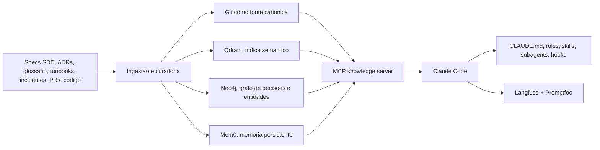

# Primeira pesquisa-ideia

Eu desenharia isso como uma arquitetura híbrida: Git é a fonte de verdade, os índices derivados dão recuperação rápida, e o Claude Code é o runtime que decide e executa. Eu não tentaria transformar o prompt em banco de conhecimento.



## Como eu estruturaria

- Fonte canônica: tudo que é conhecimento confiável fica em Git, com specs SDD, ADRs, glossário, runbooks, incidentes, convenções e integrações.
- Runtime Claude: `CLAUDE.md` para invariantes sempre ativas, `.claude/rules` para regras por caminho, `skills` para workflows reutilizáveis, `subagents` para tarefas isoladas, `hooks` para enforcement e `MCP` para acessar memória e ferramentas externas.
- Índices derivados: vetor para similaridade semântica, grafo para relações e lineage, memória persistente para fatos acumulados entre sessões.
- Governança: toda escrita importante vira PR, com fonte, status, confiança e data de revisão.

## Estrutura de base de conhecimento

```text
knowledge/
  org/
  products/<product>/
  domains/<domain>/
  repos/<repo>/
  specs/
  adr/
  incidents/
  runbooks/
  glossary/
  integrations/
```

```yaml
id: payments.chargeback-window
type: business_rule
scope: product/payments
status: active
source:
  - adr-014
  - spec-payments-233
  - incident-2026-05-17
supersedes: null
review_at: 2026-09-01
confidence: high
```

## Agentes que eu criaria

- `coordinator`: fica na sessão principal e só compõe contexto mínimo.
- `context-researcher`: busca docs, código, ADRs e incidentes e devolve um pacote curto de contexto.
- `spec-analyst`: transforma demanda em spec SDD com critérios de aceitação e riscos.
- `architect`: decide impacto arquitetural e registra ADR quando necessário.
- `implementer`: altera código guiado pela spec e pelos padrões locais.
- `reviewer`: valida consistência, segurança e aderência às convenções.
- `incident-analyst`: converte incidente em postmortem, runbook e lições aprendidas.
- `memory-curator`: promove aprendizados para a base de conhecimento e limpa duplicatas.
- `cross-repo-coordinator`: dispara trabalho em múltiplos repositórios quando o domínio é compartilhado.

## Memoria de longo prazo

- Camada 1: memoria local do Claude Code no repositório, útil para aprendizados rápidos e contextuais.
- Camada 2: memoria de subagent, boa para especialistas recorrentes, com escopo `project` como padrão quando o aprendizado deve ser compartilhado no repo.
- Camada 3: memoria organizacional, centralizada fora do prompt, versionada em Git e exposta via MCP.
- Camada 4: conhecimento derivado, como índices vetoriais e grafo, sempre reconstruíveis a partir da fonte canônica.

## Recuperacao de contexto

- Primeiro eu classificaria a pergunta: negocio, arquitetura, incidente, implementação ou operação.
- Depois eu buscaria em três fontes em paralelo: docs canônicos, busca semântica e grafo de relações.
- A resposta para o Claude viria como um `context pack` curto, com o que é mais autoritativo primeiro.
- A ordenação deveria priorizar `autoridade`, `escopo`, `frescor` e `similaridade`.
- Se houver conflito, o sistema deve expor o conflito, não esconder.

## Ferramentas que eu usaria

| Camada | Principal | Managed | Papel |
|---|---|---|---|
| Memoria persistente | [Mem0](https://github.com/mem0ai/mem0) | Mem0 Cloud | Persistir fatos, preferencias e aprendizados entre sessoes |
| RAG / ingestao | [LlamaIndex](https://github.com/run-llama/llama_index) | LlamaParse / LlamaCloud | Ingerir specs, ADRs, runbooks, docs e code snippets |
| Vector DB | [Qdrant](https://github.com/qdrant/qdrant) | Qdrant Cloud | Busca semantica, filtros e hybrid search |
| Knowledge graph | [Neo4j](https://github.com/neo4j/neo4j) | Neo4j Aura | Relacoes, dependencias, lineage e multi-hop reasoning |
| ADR management | [Log4brains](https://github.com/thomvaill/log4brains) | GitHub Pages ou S3 para publicacao | ADRs como docs-as-code, versionadas e pesquisaveis |
| Context engineering | Claude Code nativo + [Langfuse](https://github.com/langfuse/langfuse) + [Promptfoo](https://github.com/promptfoo/promptfoo) | Langfuse Cloud | Tracing, prompt management, datasets, evals e red teaming |

## Como evitar degradacao de contexto

- Mantenha `CLAUDE.md` curto, idealmente abaixo de 200 linhas, e empurre o resto para `.claude/rules` e skills.
- Use skills para workflows repetíveis, não para conhecimento sempre ativo.
- Use subagents para pesquisa, logs, testes e tarefas ruidosas, para não poluir a sessão principal.
- Não deixe o modelo escrever diretamente na memória autoritativa. Ele deve propor mudanças, e um curator ou CI valida.
- Toda memória importante precisa de `source`, `status`, `owner`, `review_at` e `supersedes`.
- Preserve o histórico. Conhecimento velho não deve sumir, deve virar `deprecated` ou `superseded`.
- Trate índices vetoriais e grafo como artefatos derivados, reconstruíveis a partir da base canônica.
- Em monorepos, exclua instruções irrelevantes com `claudeMdExcludes` e use regras por caminho.

## Como eu implantaria isso na sua squad

- Fase 1: `CLAUDE.md`, `.claude/rules`, skills, subagents, hooks, Log4brains e Promptfoo.
- Fase 2: `Qdrant` + `LlamaIndex` + `Langfuse`.
- Fase 3: `Mem0` + `Neo4j` + MCP de conhecimento compartilhado + `agent teams` / `agent view` para paralelismo entre repositórios.
- Para uma squad pequena, eu começaria com a fase 1 e 2. A fase 3 entra quando o problema real for relacionamento entre domínios e repositórios, não antes.

## Se eu fosse resumir em uma frase

Eu colocaria a verdade no Git, a memória operacional em camadas recuperáveis, e o Claude Code como orquestrador que recebe contexto filtrado, não como o repositório principal do conhecimento.

## Fontes principais

- [Claude Code docs index](https://code.claude.com/docs/llms.txt)
- [How Claude remembers your project](https://code.claude.com/docs/en/memory.md)
- [Create custom subagents](https://code.claude.com/docs/en/sub-agents.md)
- [Extend Claude Code](https://code.claude.com/docs/en/features-overview.md)
- [Automate actions with hooks](https://code.claude.com/docs/en/hooks-guide.md)
- [Set up Claude Code in a monorepo or large codebase](https://code.claude.com/docs/en/large-codebases.md)
- [Orchestrate teams of Claude Code sessions](https://code.claude.com/docs/en/agent-teams.md)
- [Manage multiple agents with agent view](https://code.claude.com/docs/en/agent-view.md)

## Revisita da Fase 1: checklist de execução e validação

Esta seção revisita a proposta original de Fase 1 (`CLAUDE.md`, `.claude/rules`, skills, subagents, hooks, Log4brains e Promptfoo) contra o estado atual deste repositório. O objetivo é separar o que já foi materializado, o que está parcialmente coberto e quais validações podem ser executadas agora.

### Status executivo da Fase 1

| Item da Fase 1 | Status | Evidência no repositório | Observação |
|---|---|---|---|
| `CLAUDE.md` como contrato sempre ativo | Concluído | `CLAUDE.md` e `.claude/CLAUDE.md` | Já existe contrato raiz e contrato operacional do runtime Claude. |
| `.claude/rules` por governança, contexto cross-repo e SDD | Concluído | `.claude/rules/00-memory-governance.md`, `.claude/rules/10-cross-repo-context.md`, `.claude/rules/20-sdd-lifecycle.md` | As regras cobrem escrita de memória, compartilhamento entre repositórios e ciclo SDD. |
| Skills reutilizáveis | Concluído | `.claude/skills/context-pack/`, `.claude/skills/memory-curation/`, `.claude/skills/cross-repo-synthesis/` | Os skills já têm `SKILL.md` e servem como workflows reutilizáveis. |
| Subagents especializados | Concluído | `.claude/agents/*.md` | Foram criados os agentes da fase inicial: coordinator, context-researcher, spec-analyst, architect, implementer, reviewer, incident-analyst, memory-curator e cross-repo-coordinator. |
| Templates operacionais de sessão | Concluído | `.claude/templates/*.md` | Já existem templates para context-researcher, memory-curator, spec-analyst, architect e reviewer. |
| Hooks de enforcement | Concluído | `hooks/memory_hooks.py` e `hooks/README.md` | O hook valida propostas, bloqueia escrita direta em memória canônica e promove propostas `ready`. |
| Instalador local para Claude Code | Concluído | `scripts/install_claude_assets.py` | O script instala agents, skills e hooks em `CLAUDE_CONFIG_DIR` ou `~/.claude` sem interação com o usuário. |
| Knowledge canônico versionado em Git | Concluído | `knowledge/org/*.md` | Os contratos de governança, escopo, context pack, ciclo de agentes e curadoria já foram promovidos. |
| Exemplos de fluxo product/repo | Concluído | `knowledge/products/` e `knowledge/repos/` | Há exemplos para demonstrar compartilhamento entre produto e repositório. |
| Área de propostas e promoção | Concluído | `knowledge/_proposals/` | O pacote inicial demonstra propostas, exemplo de Context Pack e critérios de promoção. |
| Log4brains | Não iniciado nesta fase prática | `knowledge/adr/README.md` existe, mas não há integração Log4brains | A proposta original citava Log4brains; por enquanto a Fase 1 implementada cobre ADR/docs-as-code por estrutura de pastas, sem ferramenta externa. |
| Promptfoo | Não iniciado nesta fase prática | Sem arquivos de configuração Promptfoo | A proposta original citava Promptfoo; por enquanto há checklist e hooks locais, mas ainda não há evals automatizadas de prompts. |

### Veredito da Fase 1

A Fase 1 foi executada com êxito para o núcleo operacional de memória entre sessões e repositórios:

- contratos de topo existem;
- regras, agentes, skills e templates estão materializados;
- a base `knowledge/` tem governança, escopo, fluxo de curadoria e exemplos;
- os hooks locais validam e protegem o ciclo de memória;
- existe instalador não interativo para distribuir os assets do Claude Code por máquina.

A Fase 1 ainda não está completa se considerarmos literalmente todas as ferramentas citadas na pesquisa inicial. `Log4brains` e `Promptfoo` continuam como próximos incrementos opcionais, não como bloqueadores do fluxo atual de memória.

### Checklist de aceite da Fase 1

- [x] Existe `CLAUDE.md` na raiz com visão operacional do projeto.
- [x] Existe `.claude/CLAUDE.md` com contrato específico para o runtime Claude.
- [x] Existem regras em `.claude/rules/` para governança de memória, contexto cross-repo e SDD.
- [x] Existem agentes especializados em `.claude/agents/`.
- [x] Existem templates operacionais em `.claude/templates/` para os principais agentes de análise, arquitetura, review, pesquisa e curadoria.
- [x] Existem skills reutilizáveis em `.claude/skills/`.
- [x] Existe base canônica em `knowledge/org/`.
- [x] Existem exemplos de escopo em `knowledge/products/` e `knowledge/repos/`.
- [x] Existe área de propostas em `knowledge/_proposals/`.
- [x] Existe utilitário de hooks em `hooks/memory_hooks.py`.
- [x] Existe instalador não interativo em `scripts/install_claude_assets.py`.
- [x] O fluxo `proposal -> ready -> canonical` está documentado.
- [x] O `Context Pack` tem contrato formal e exemplo.
- [x] O `memory-curator` tem fluxo de promoção com checklist e critérios de aceite.
- [ ] Existe integração real com Log4brains.
- [ ] Existe suíte Promptfoo para avaliação automatizada de prompts/agentes.
- [ ] Existe pipeline CI completo executando todos os testes de validação abaixo.

### Testes possíveis agora para validação

#### 1. Validação estrutural do repositório

Objetivo: garantir que os diretórios e contratos mínimos da Fase 1 existem.

```bash
test -f CLAUDE.md
test -f .claude/CLAUDE.md
test -d .claude/agents
test -d .claude/rules
test -d .claude/skills
test -d .claude/templates
test -d knowledge/org
test -d knowledge/_proposals
test -f hooks/memory_hooks.py
test -f scripts/install_claude_assets.py
```

#### 2. Validação de sintaxe Python

Objetivo: garantir que os scripts executáveis continuam compilando.

```bash
python3 -m py_compile hooks/memory_hooks.py scripts/install_claude_assets.py
```

#### 3. Validação do contrato de proposta

Objetivo: garantir que uma proposta existente continua válida para o hook de memória.

```bash
python3 hooks/memory_hooks.py validate-proposal knowledge/_proposals/2026-06-09-memory-foundation/01-memory-governance.md
```

#### 4. Validação de promoção registrada

Objetivo: garantir que o exemplo de promoção do `memory-curator` respeita o contrato de checklist e critérios de aceite.

```bash
python3 hooks/memory_hooks.py validate-promotion knowledge/org/memory-curator-promotion-example.md
```

#### 5. Validação do guard de escrita canônica

Objetivo: garantir que escrita direta em memória canônica é bloqueada pelo hook.

```bash
python3 hooks/memory_hooks.py guard-write --path knowledge/org/memory-governance.md
```

Resultado esperado: o comando deve falhar/bloquear, porque escrita direta em `knowledge/org/` deve passar por proposta e curadoria.

#### 6. Validação de promoção automática em modo seguro

Objetivo: garantir que o hook consegue varrer proposals `ready` sem alterar o repositório.

```bash
python3 hooks/memory_hooks.py promote-ready --queue knowledge/_proposals --dry-run
```

#### 7. Validação do instalador sem tocar no ambiente real

Objetivo: garantir que o instalador consegue montar agents, skills e hooks em um diretório temporário.

```bash
python3 scripts/install_claude_assets.py --config-dir /tmp/claude-install-test --dry-run
python3 scripts/install_claude_assets.py --config-dir /tmp/claude-install-test --force
```

Em Windows, trocar `/tmp/claude-install-test` por um diretório temporário local, por exemplo `%TEMP%\\claude-install-test`.

#### 8. Validação documental mínima

Objetivo: garantir que os pontos de entrada principais continuam mencionando o fluxo de memória.

```bash
rg -n "Context Pack|memory-curator|promote-ready|install_claude_assets|knowledge/_proposals" README.md QUICKSTART.md CLAUDE.md knowledge/README.md .claude/CLAUDE.md
```

### Próximas validações recomendadas

- Criar um teste automatizado em `tests/` para validar a presença dos arquivos obrigatórios da Fase 1.
- Criar fixtures de proposals `draft`, `ready`, `promoted` e `rejected` para testar `hooks/memory_hooks.py` sem depender dos documentos reais.
- Adicionar CI com `py_compile`, validação estrutural, validação de proposals e teste do instalador em diretório temporário.
- Introduzir Promptfoo apenas quando houver prompts/agentes com outputs esperados suficientemente estáveis.
- Introduzir Log4brains apenas quando os ADRs reais começarem a crescer e precisarem de publicação/navegação dedicada.
