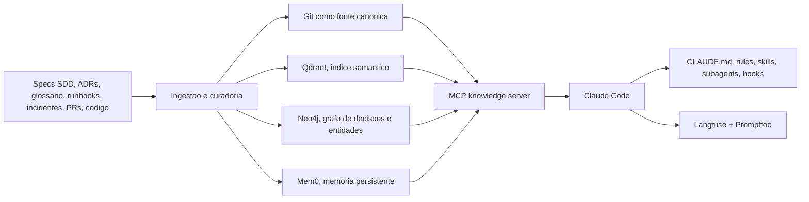

# Primeira pesquisa-ideia

Eu desenharia isso como uma arquitetura híbrida: Git é a fonte de verdade, os índices derivados dão recuperação rápida, e o Claude Code é o runtime que decide e executa. Eu não tentaria transformar o prompt em banco de conhecimento.



## Como eu estruturaria

- Fonte canônica: tudo que é conhecimento confiável fica em Git, com specs SDD, ADRs, glossário, runbooks, incidentes, convenções e integrações.
- Runtime Claude: `CLAUDE.md` para invariantes sempre ativas, `.claude/rules` para regras por caminho, `skills` para workflows reutilizáveis, `subagents` para tarefas isoladas, `hooks` para enforcement e `MCP` para acessar memória e ferramentas externas.
- Índices derivados: vetor para similaridade semântica, grafo para relações e lineage, memória persistente para fatos acumulados entre sessões.
- Governança: toda escrita importante vira PR, com fonte, status, confiança e data de revisão.

## Estrutura de base de conhecimento

```text
knowledge/
  org/
  products/<product>/
  domains/<domain>/
  repos/<repo>/
  specs/
  adr/
  incidents/
  runbooks/
  glossary/
  integrations/
```

```yaml
id: payments.chargeback-window
type: business_rule
scope: product/payments
status: active
source:
  - adr-014
  - spec-payments-233
  - incident-2026-05-17
supersedes: null
review_at: 2026-09-01
confidence: high
```

## Agentes que eu criaria

- `coordinator`: fica na sessão principal e só compõe contexto mínimo.
- `context-researcher`: busca docs, código, ADRs e incidentes e devolve um pacote curto de contexto.
- `spec-analyst`: transforma demanda em spec SDD com critérios de aceitação e riscos.
- `architect`: decide impacto arquitetural e registra ADR quando necessário.
- `implementer`: altera código guiado pela spec e pelos padrões locais.
- `reviewer`: valida consistência, segurança e aderência às convenções.
- `incident-analyst`: converte incidente em postmortem, runbook e lições aprendidas.
- `memory-curator`: promove aprendizados para a base de conhecimento e limpa duplicatas.
- `cross-repo-coordinator`: dispara trabalho em múltiplos repositórios quando o domínio é compartilhado.

## Memoria de longo prazo

- Camada 1: memoria local do Claude Code no repositório, útil para aprendizados rápidos e contextuais.
- Camada 2: memoria de subagent, boa para especialistas recorrentes, com escopo `project` como padrão quando o aprendizado deve ser compartilhado no repo.
- Camada 3: memoria organizacional, centralizada fora do prompt, versionada em Git e exposta via MCP.
- Camada 4: conhecimento derivado, como índices vetoriais e grafo, sempre reconstruíveis a partir da fonte canônica.

## Recuperacao de contexto

- Primeiro eu classificaria a pergunta: negocio, arquitetura, incidente, implementação ou operação.
- Depois eu buscaria em três fontes em paralelo: docs canônicos, busca semântica e grafo de relações.
- A resposta para o Claude viria como um `context pack` curto, com o que é mais autoritativo primeiro.
- A ordenação deveria priorizar `autoridade`, `escopo`, `frescor` e `similaridade`.
- Se houver conflito, o sistema deve expor o conflito, não esconder.

## Ferramentas que eu usaria

| Camada | Principal | Managed | Papel |
|---|---|---|---|
| Memoria persistente | [Mem0](https://github.com/mem0ai/mem0) | Mem0 Cloud | Persistir fatos, preferencias e aprendizados entre sessoes |
| RAG / ingestao | [LlamaIndex](https://github.com/run-llama/llama_index) | LlamaParse / LlamaCloud | Ingerir specs, ADRs, runbooks, docs e code snippets |
| Vector DB | [Qdrant](https://github.com/qdrant/qdrant) | Qdrant Cloud | Busca semantica, filtros e hybrid search |
| Knowledge graph | [Neo4j](https://github.com/neo4j/neo4j) | Neo4j Aura | Relacoes, dependencias, lineage e multi-hop reasoning |
| ADR management | [Log4brains](https://github.com/thomvaill/log4brains) | GitHub Pages ou S3 para publicacao | ADRs como docs-as-code, versionadas e pesquisaveis |
| Context engineering | Claude Code nativo + [Langfuse](https://github.com/langfuse/langfuse) + [Promptfoo](https://github.com/promptfoo/promptfoo) | Langfuse Cloud | Tracing, prompt management, datasets, evals e red teaming |

## Como evitar degradacao de contexto

- Mantenha `CLAUDE.md` curto, idealmente abaixo de 200 linhas, e empurre o resto para `.claude/rules` e skills.
- Use skills para workflows repetíveis, não para conhecimento sempre ativo.
- Use subagents para pesquisa, logs, testes e tarefas ruidosas, para não poluir a sessão principal.
- Não deixe o modelo escrever diretamente na memória autoritativa. Ele deve propor mudanças, e um curator ou CI valida.
- Toda memória importante precisa de `source`, `status`, `owner`, `review_at` e `supersedes`.
- Preserve o histórico. Conhecimento velho não deve sumir, deve virar `deprecated` ou `superseded`.
- Trate índices vetoriais e grafo como artefatos derivados, reconstruíveis a partir da base canônica.
- Em monorepos, exclua instruções irrelevantes com `claudeMdExcludes` e use regras por caminho.

## Como eu implantaria isso na sua squad

- Fase 1: `CLAUDE.md`, `.claude/rules`, skills, subagents, hooks, Log4brains e Promptfoo.
- Fase 2: `Qdrant` + `LlamaIndex` + `Langfuse`.
- Fase 3: `Mem0` + `Neo4j` + MCP de conhecimento compartilhado + `agent teams` / `agent view` para paralelismo entre repositórios.
- Para uma squad pequena, eu começaria com a fase 1 e 2. A fase 3 entra quando o problema real for relacionamento entre domínios e repositórios, não antes.

## Se eu fosse resumir em uma frase

Eu colocaria a verdade no Git, a memória operacional em camadas recuperáveis, e o Claude Code como orquestrador que recebe contexto filtrado, não como o repositório principal do conhecimento.

## Fontes principais

- [Claude Code docs index](https://code.claude.com/docs/llms.txt)
- [How Claude remembers your project](https://code.claude.com/docs/en/memory.md)
- [Create custom subagents](https://code.claude.com/docs/en/sub-agents.md)
- [Extend Claude Code](https://code.claude.com/docs/en/features-overview.md)
- [Automate actions with hooks](https://code.claude.com/docs/en/hooks-guide.md)
- [Set up Claude Code in a monorepo or large codebase](https://code.claude.com/docs/en/large-codebases.md)
- [Orchestrate teams of Claude Code sessions](https://code.claude.com/docs/en/agent-teams.md)
- [Manage multiple agents with agent view](https://code.claude.com/docs/en/agent-view.md)
